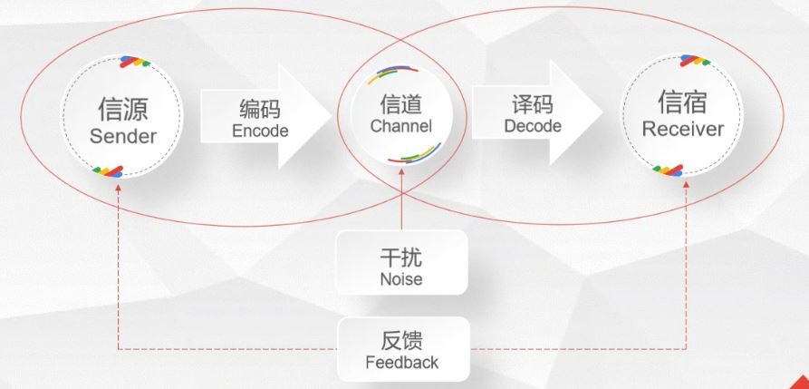
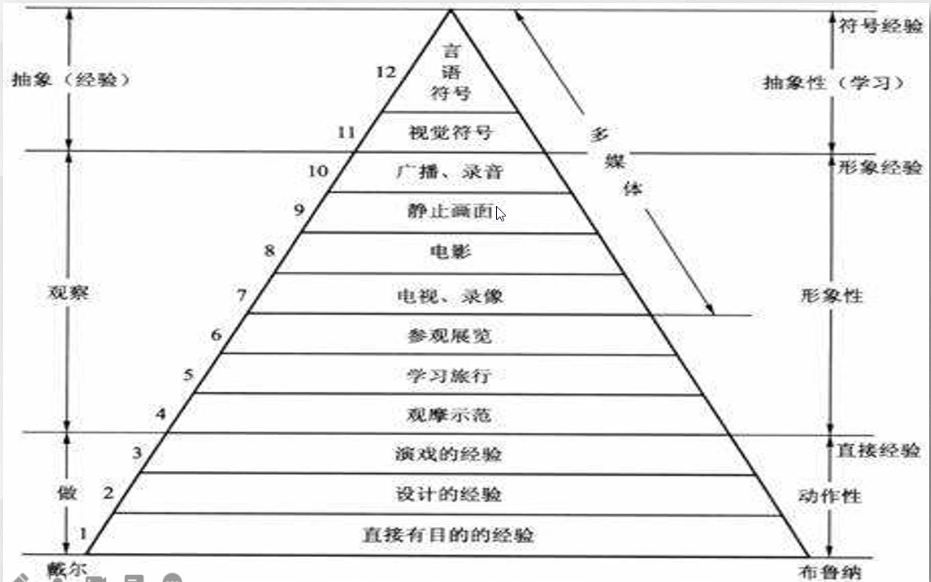

# 5-10

## Moodle回顾

## Technologies of Distance Education

### 传播模型

- 香农-韦弗传播模式

示例图

- 经验之塔

  		1. Direct purposeful experiences
  		2. Contrived experiences
  		3. Dramatized experiences
  		4. Demonstrations
  		5. Study trips，viewing reality
  		6. Exhibits
  		7. Educational television
  		8. Motion picture
  		9. Still pictures
  		10. Radio and recordings
  		11. Visual symbols
  		12. Verbal symbols