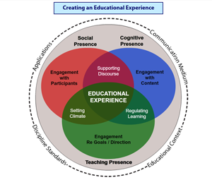

# 4-12

## 系统理论

- 任何一个事物都可以看成一个系统
- 任何一个系统都是由要素构成的
- 要素和要素之间存在某种关系
- 关系决定结构
- 结构决定功能

## 农远工程

- 2003年开始
- 三种模式
  1. 教学光盘播放点
  2. 卫星教学收视点
  3. 计算机教室

## Community of Inquiry

- Social Presence
- Teaching Presence
- Cognitive Presence
