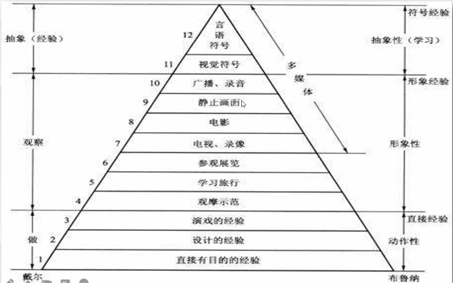

# 5 - 10 - Technologies of Distance Education

## Moodle回顾

- 总结Moodle安装出现的问题以及相应的解决方案
- Moodle平台十分强大，功能丰富

## 传播模型

### 香农-韦弗传播模式（示例图）

- The instructional message is then sent to the learner over a channel.（教学信息通过信道发送给学习者）

  tip：**Media** （媒体）——信道的一种，延申了感官，教学信息可以远距离发送，或储存在不同的时间进行学习

- Feedback allows the sender and receiver, the teacher and learner, to determine if the message was understood correctly（反馈帮助信源、信宿确定信息是否被正确理解）

##  经验之塔

  		1. Direct purposeful experiences
  		2. Contrived experiences
  		3. Dramatized experiences
  		4. Demonstrations
  		5. Study trips，viewing reality
  		6. Exhibits
  		7. Educational television
  		8. Motion picture
  		9. Still pictures
  		10. Radio and recordings
  		11. Visual symbols
  		12. Verbal symbols

## 远程教育技术的分类

### Four strategies for organizing instruction for online delivery

- linear programmed instruction（线性程序教学）
- branched programmed instruction（分支程序教学）
- hyper-programmed instruction（超程序教学）
- student-programmed instruction（学生程序教学）

### Distance Education Technologies

1. Correspondence Study（函授学习）
2. Prerecorded Media（预先录制的媒体）
3. Two - Way Audio（双向音频）
4. Two - Way Audio with Graphics（图形双向音频）
5. One - Way Live Video（单向视频直播）
6. Two - Way Audio, One - Way Video（双向音频，单向视频）
7. Two - Way Audio / Video（双向音频，双向视频）
8. Desktop Two - Way Audio / Video（桌面双向音频，视频）

## 远程教育教室

现代远程教育教室由非常多的软硬件构成，下面是本组的设计方案

