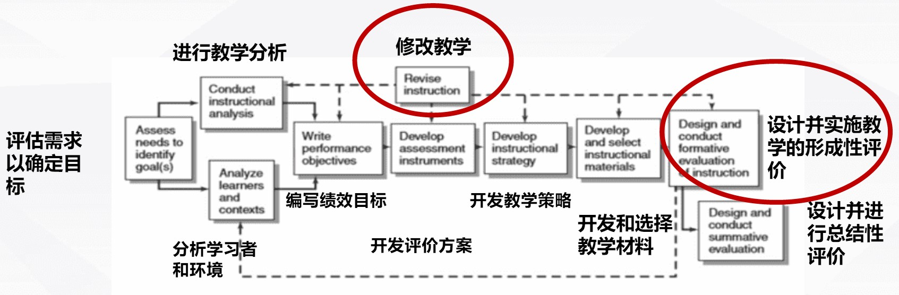

# 5 - 17 - Instructional Design for Distance Education

## Why plan for teaching at a distance（为什么要计划远程教学）

Teaching at a distance, whether **synchronous **or **asynchronous**, requires that greater emphasis be placed on the initial planning phase.（远程教学，无论**同步**的还是**异步**的，都需要在最初的计划阶段给予更多重视）

### The instructional systems design model (Dick and Carey)

## Issues to address in the planning process（规划过程中需要处理的问题）

### Who Are the Learners？（即学习者分析）

- Analysis of the cognitive abilities of the  class（班级认知能力分析）
- Analysis Potential for Learner Interactivity（分析学习者互动的潜力）
- Understand Learner Characteristics（了解学习者的特点）
- Help Learners Understand the Context of the Learning Experience（帮助学习者理解学习经验的背景）

### What Is the Essential Content？（即教学内容分析）

- Examine the nature of the content（检查内容的性质）
- Examine the sequence of information（检查信息呈现的顺序）
- Goals and Objectives for Instruction（教育目标）

## Principles of Instructional Design Systems（教学设计系统的原则）

### Systematic Process（系统过程）

Consider the components of a successful learning system

- Learners（学习者）
- Content（学习内容）
- Method（学习方法）
- **Evaluation**（评价）
- Materials（材料）
- Environment（环境）
- Technology（技术）

### Planning for Instruction at a Distance（远程教学计划）

- In revising traditional classroom materials, consider ways to illustrate key concepts, or topics, using tables, figures, and other visual representations.（在修改传统的课堂材料时，考虑如何说明关键问题概念或主题，使用表格、图形和其他视觉表示）
- Plan activities that encourage interactivity at all the sites.（计划在所有站点鼓励互动的活动）
- Plan activities that allow for student group work.（计划允许学生小组活动的活动）
- Be prepared in the event that technical problems occur.（一旦出现技术问题，要做好准备）
