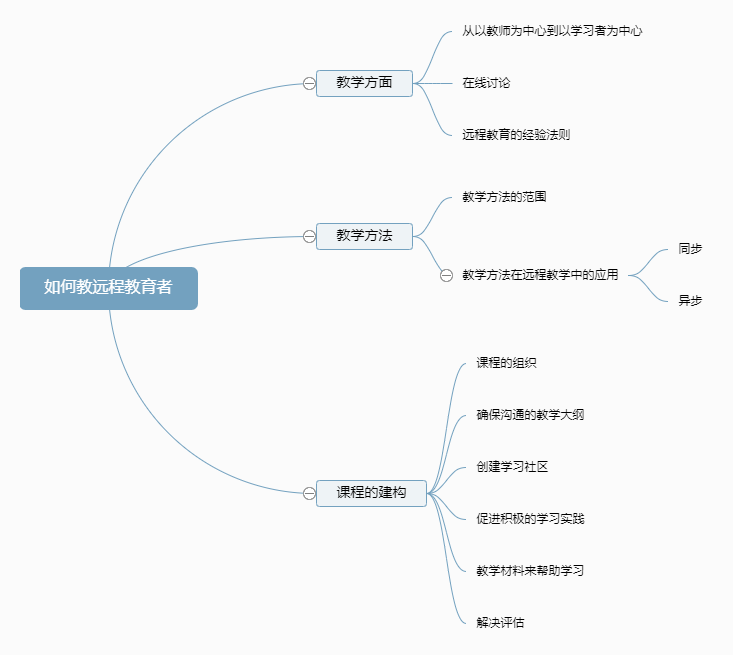
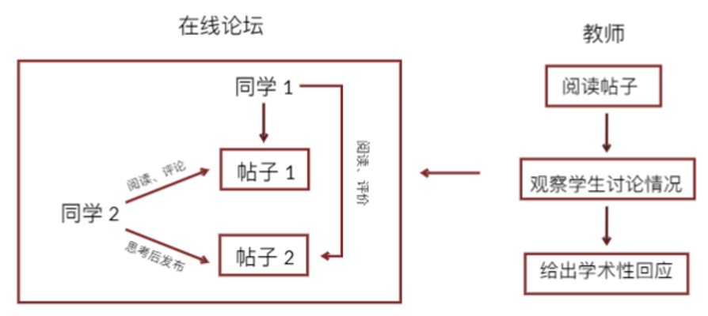

# 5 - 24 - Teaching and Distance Education

## 课程导入

### 教学目标——为教师进行远程教学提供指导

五个需要考虑的问题：

1. Describe the responsibilities of the instructor in distance education.（描述教师在远程教育中的职责）
2. Explain the importance of creating a learning community.（解释创建学习型社区的重要性）
3. Identify ways to enhance delivery of instruction.（确定提高教学传输的方法 ）
4. Discuss the preparation of instructional materials.（讨论教学材料的准备）
5. Discuss policy issues as they relate to instruction.（讨论与教学有关的政策问题）

### 远距离指导的质量:煤浆池

### 衡量远程教育质量的三个维度

#### Learner（学习者）

- ease of access and usability.（方便使用）
- accurate instructions.（准确的指示）
- intuitive navigation and well-integrated tools.（直观的导航和良好的集成工具）

#### Faculty（教师）

- ease of instruction and consistent with standards.（易于指导并符合标准）
- intuitive and customizable course management system.（直观可定制的课程管理系统）
- ease of preparation and updating.（易于准备和更新）

#### Administration

- comparable rigor to nondistance classes.（与非远程类教育一样严格）
- increased enrollment.（增加入学人数）
- maintenance of institution's reputation.（维护机构声誉）

## 如何教远程教育者

## 与远程学习者相关的政策问题

### Academic（学术）

- 教师的问题：制定明确远程教育职责的政策
- 补偿与支持：教师薪酬和技术支持、访问资源
- 教师的资格

### Intellectual Freedom and Ownership/Property Rights（知识自由和所有权/财产权）

- with reward 有报酬，所有权归组织
- without reward 没有报酬，所有权归教师

### Course Integrity（课程的完整性）

- Accreditation（认证）
- Curriculum and Standards（课程和标准）
- Course Rigor（课程严谨）
- Calendar and Schedules（日历和日程安排）

### Student Support（学生支持）

- Access to Resources（获得资源）
- Special Services（特殊服务）

### Institutional（机构）

- Fiscal and Governance（财政和治理）
- Geographic Service Area（地理服务区域）

### Legal Issues（法律问题）

- Copyright（版权）

### Technical Policies（技术政策）

- Reliability of Resources（技术的可靠性）
- Technology Requirements（技术要求）

