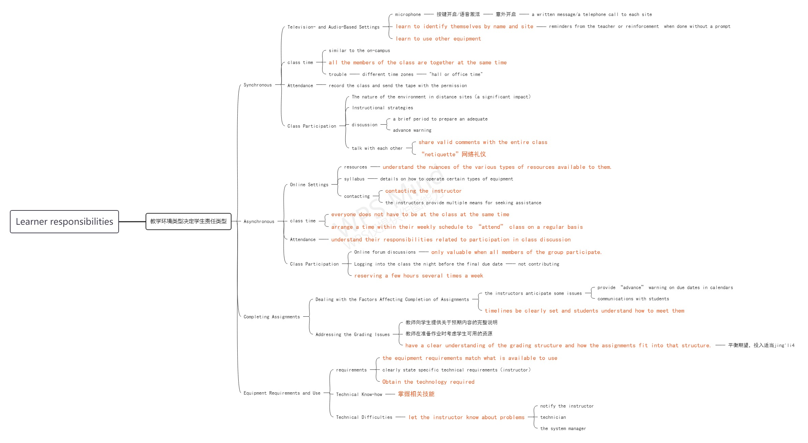

# 5 - 31 - The Student and Distance Education

## Characteristics of the Distance Student

- any age（任何年龄）
- any education level（任何教育水平）
- a variety of educational needs（有各种教育需求）
- self-starters（自发的）
- highly motivated（有很强的积极性）
- live in rural areas（生活于农村地区）

### Adult Leaners

| White-collar | easier and more flexible          |
| ------------ | --------------------------------- |
| Blue-collar  | more complicated                  |
| Male         | flexibility, academic achievement |
| Female       | self-discipline, self-pacing      |

### P-12 Learners

- more diversity（更多的多样性）
- digital divide（数字鸿沟）
- access to resources is limited（获取资源的途径有限）

## Attitude Factors

### Classroom Culture（课堂文化）

- learning communities（学习共同体）

1. promotes shared learning experiences and teamwork（促进分享学习经验和团队合作）
2. create it is the responsibility of all participants（创造这种文化事所有参与者的责任）
3. collaborative learning（协作学习）
4. knowledge, skills, and ability to self-assess（知识、技能和自我评估的自己的能力）

### Etiquette（礼节）

- sensitivities and considerations（语言的敏感性和课堂上的一些注意事项）

## Experience Issues

### Learning Experiences（学习经验）

- background of students（学生的背景）
- the syllabus（教学大纲）

### Distance Learning Experience（远程学习经验）

- Informal learning（非正式学习）

## Elements For Success

### General Ability（一般能力）

### Prior Knowledge（先验知识）

### Learning Styles（学习风格）

- Visual（视觉型）
- Auditory（听觉型）
- Read-Write（读写型）
- Kinesthetic（动觉型）

## Learner Responsibilities

